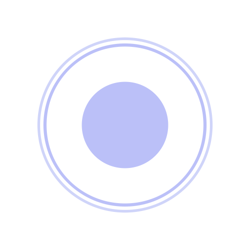
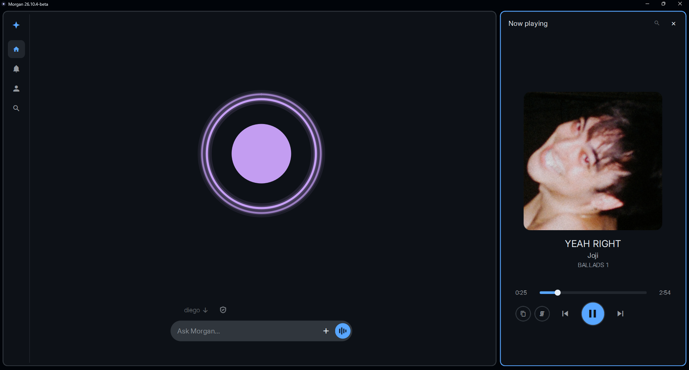
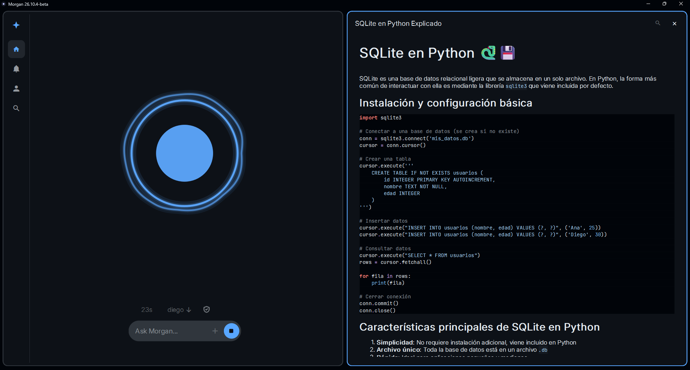
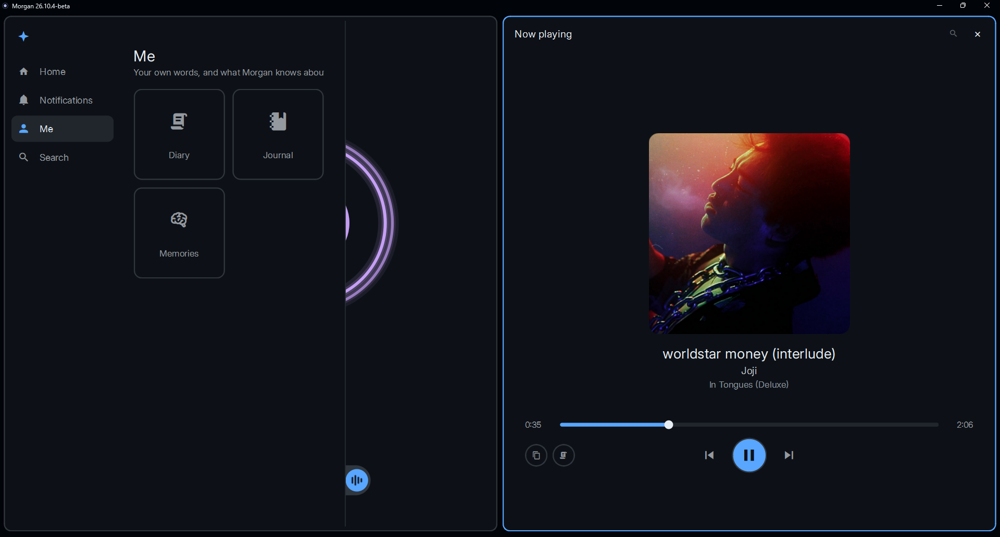
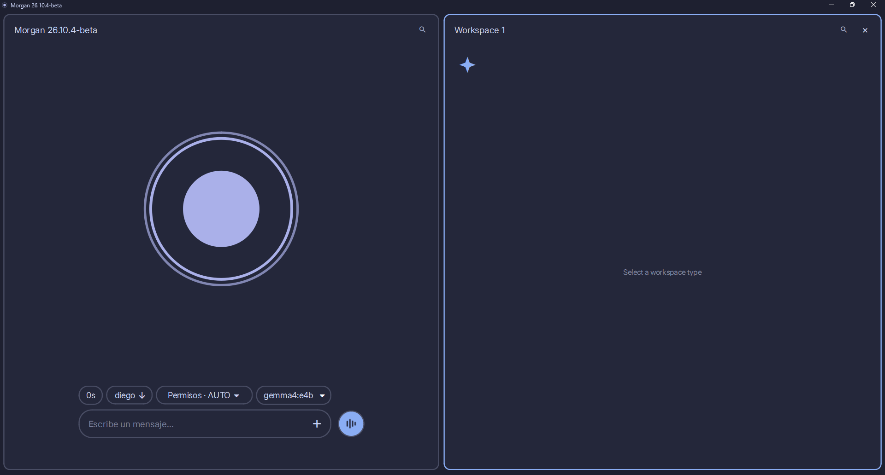
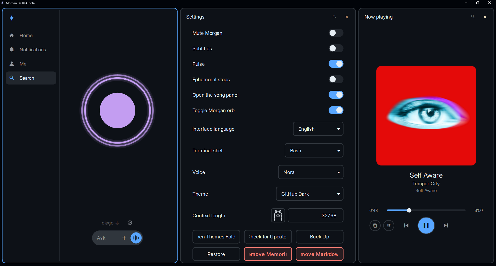

<p align="center">
  
</p>

<h1 align="center">MORGAN</h1>

<p align="center">
  <b>M</b>y <b>O</b>rganizer for <b>R</b>eminders, <b>G</b>oals, <b>A</b>ctivities and <b>N</b>otes
</p>

<p align="center">
  A local desktop assistant that uses Ollama to run tools and automate tasks on Windows.
</p>

<p align="center">
  
  
  
  
</p>

<p align="center">
  <a href="#-features">Features</a> ·
  <a href="#-installation">Installation</a> ·
  <a href="#-running-from-source">Source</a> ·
  <a href="#-platform-packages">Platforms</a> ·
  <a href="#-usage">Usage</a> ·
  <a href="#-license">License</a>
</p>

<p align="center">
  
</p>

---

## ✦ Features

- Local assistant model (`qwen3.5:4b` through Ollama) for text, images and
  voice, with tool calling to run commands, read and edit files and automate
  tasks on the PC, and a separate coding model (`qwen3.5:9b`) that takes over
  real coding jobs and requests that turn out to be long or hard, and that
  Ollama loads only while it is used.
- Spoken replies with CosyVoice, hands-free wake phrase activation and live
  voice input. See [wake voice](docs/WAKE-VOICE.md).
- Persistent local memory in SQLite, with pinned memories that are always in
  context. See [memory](docs/MEMORY.md).
- Nova, a personal organizer with reminders and events (flags and daily,
  weekly, monthly or custom repeats), a calendar, a diary of every day's
  conversations, a personal journal you can write or dictate to Morgan, a weekly review, memories and search
  across all of it. Morgan manages it from
  chat, and due reminders arrive as Windows notifications with snooze buttons.
- Tiling workspaces for editors, files, diffs, PDFs, terminals and Nova. See
  [workspaces](docs/WORKSPACES.md).
- File attachments and `@file` references. See
  [attachments](docs/ATTACHMENTS.md).
- Local PC health diagnostics tools. See [diagnostics](docs/DIAGNOSTICS.md).
- A health view in the command palette that checks Ollama, GPU use and the
  voice service.
- 26 built-in color themes and interface languages in Spanish, English,
  Chinese (Simplified), French, German, Portuguese (Brazil), Japanese, Russian,
  Korean and Italian.
- Settings buttons to back up and restore memories, Nova and the daily logs,
  and to check for updates from the GitHub releases.

<p align="center">
  
  <br>
  <sub>Answers open in a workspace pane beside the chat.</sub>
</p>

<p align="center">
  
  <br>
  <sub>Me: your diary, your journal and what Morgan remembers.</sub>
</p>

---

## ✦ Installation

Run `MorganSetup.exe` (Windows 10 or later, 64-bit). No administrator rights are
required. The installer:

- installs `Morgan.exe` to `C:\Morgan` by default, with a Start menu entry and an
  optional desktop shortcut;
- asks for the assistant name (default `Morgan`) and sets the `MORGAN` environment
  variable (or `<NAME>` for a custom name) to the installation folder;
- installs Git for Windows through WinGet if Git Bash is not found;
- installs Ollama through WinGet if it is missing, starts it, and downloads the
  `qwen3.5:4b` assistant model (about 3.3 GB) and the `qwen3.5:9b` coding model
  (about 6.6 GB);
- creates the data directory `C:\Users\<username>\.<name>` (`.morgan` for the
  default name), saves the chosen name in its `config.json`, and downloads the
  CosyVoice voice model (`Fun-CosyVoice3-0.5B-2512`, about 6.3 GB) from Hugging
  Face into `models\Fun-CosyVoice3-0.5B` inside it if it is missing. Interrupted
  downloads resume on the next run, and files already present are skipped;
- installs FFmpeg and Python 3.12 through WinGet if they are missing, and
  creates the voice runtime (`.venv` inside the installation folder) with
  PyTorch (CUDA build on NVIDIA GPUs, ROCm build on AMD Radeon GPUs together
  with TorchCodec and the shared FFmpeg libraries it loads, CPU build
  otherwise) and the CosyVoice dependencies. No repository clone is needed; when a cloned repository is
  found through `MORGAN_HOME`, this step is skipped and its `.venv` is used.

Configuration and user data are stored in `C:\Users\<username>\.<name>`. Refer
to the source code and `config.json` to discover additional features and
configuration options.

The `assistant` section of `config.json` sets the assistant's identity:

```json
"assistant": { "name": "Morgan", "gender": "auto" }
```

`gender` controls the grammatical gender Morgan uses about itself in the first
person (for example "listo" or "lista" in Spanish). It accepts `auto` (inferred
from the name, the default), `male`, `female` or `neutral`.

To start Morgan, open it from the Start menu or run `Morgan.exe`. See the
[specs here](docs/SPECS.md) for model and hardware requirements.

---

## ✦ Running from source

Running from a clone requires Windows, PowerShell, Python 3.12 and Git, with
the dependencies from `requirements.txt` installed in a `.venv` virtual
environment at the repository root.

Start the desktop application with `scripts\morgan-start.bat`. It starts Ollama,
loads the model and the TTS service through `scripts\morgan-services.ps1`, and
then launches the installed `Morgan.exe` if one is found, or `entry.desktop` from
the `.venv` otherwise.

To build the executable, run `scripts/build-exe.sh` from Git Bash (PyInstaller,
output in the folder named by the `MORGAN` environment variable, which the
installer sets to the installation folder, or `C:\Morgan` when it is not set, so
a build replaces the installed copy), then compile `MorganSetup.iss` with Inno Setup.
`scripts\rebuild.bat` builds the desktop and compiles the installer. The installer is written to
`build\installer\MorganSetup.exe`. `dev\export_orb_icon.py` regenerates
`assets\morgan.ico` and `assets\morgan.png` from the orb widget.

---

## ✦ Platform packages

The core of Morgan (`src/init`, `src/diagnostics` and `entry`) does not call
operating system APIs directly. Everything system-specific goes through the
platform layer in `src/platforms`:

- `base.py` defines the `Platform` interface: windows and app launching,
  folders and drives, notifications, processes and power, package management,
  media sessions, terminals, services, updates, window styling and system
  telemetry. Its defaults are portable (a POSIX terminal, `fcntl` file locks,
  `sudo`), and anything a platform cannot provide raises
  `UnsupportedOperation`, which the core reports as an unsupported feature.
- `winx64` implements it for Windows x64 with Win32, the Shell, PowerShell,
  WinRT, ConPTY and WinGet.
- `macx64` implements it for macOS with AppKit, Quartz, AppleScript and
  Homebrew. It targets Apple Silicon, because the pinned PyTorch and ONNX
  Runtime have no Intel Mac builds. It has not been tested on a Mac yet, and
  macOS still has no song recognition from system audio and no diagnostics.
  `scripts/morgan-services.sh` is the macOS counterpart of
  `scripts\morgan-services.ps1`: it starts Ollama (from `PATH`, Homebrew or
  `Ollama.app`), preloads the model, starts CosyVoice from the repository's
  `.venv`, restarting it when its sources changed, and opens a Terminal window
  that follows the TTS and agent logs (`--no-console` and `--no-voice` skip
  them). Morgan runs it at startup on macOS; a packaged app finds it through
  `MORGAN_HOME` pointing at the repository's `scripts` folder.
  `scripts/build-dmg.sh`, run on an Apple Silicon Mac with the dependencies
  from `requirements.txt` in `.venv`, builds `Morgan.app` with PyInstaller
  (in `build/packaging-macos/dist`) and packs it into
  `build/installer/Morgan-<version>.dmg`. `scripts/rebuild.sh` runs that build,
  stops at a failure and opens `build/installer`. The build is only ad-hoc
  signed, so macOS asks for confirmation the first time it opens until it is
  signed and notarized with an Apple Developer ID.
- `linuxx64` implements it for Linux with `wmctrl` and `xdotool` (X11 windows),
  `playerctl` (MPRIS media), `notify-send`, `gio`, `systemctl`, `.desktop`
  entries and `pacman`, `apt`, `dnf` or `zypper`. System audio capture uses
  SoundCard through PulseAudio or PipeWire. It has not been tested on every
  distribution, and window control does not work on pure Wayland sessions.
  `scripts/morgan-services.sh` also runs on Linux, opening the debug console in
  the first terminal emulator it finds. `scripts/build-linux.sh`, run on Linux
  with the dependencies from `requirements.txt` in `.venv`, builds Morgan with
  PyInstaller (in `build/packaging-linux/dist`), drops the unused GTK, QML and
  NVIDIA libraries and packs it into the self-extracting
  `build/installer/MorganSetup.run` (about 165 MB, xz-compressed).
  `./MorganSetup.run` installs it under `~/.local/opt/Morgan` with a menu
  entry and a `morgan` command, then runs `scripts/setup-runtime.sh`, the
  counterpart of `setup-runtime.ps1`: it installs Ollama (official script,
  with confirmation), pulls the models, creates `Morgan/.venv` with Python 3.12
  through `uv`, installs PyTorch for the detected GPU (ROCm, CUDA or CPU) and
  the voice dependencies, and downloads the CosyVoice model and timezone data.
  `--no-runtime` skips that step, `--prefix FOLDER` changes the folder and
  `--uninstall` removes everything. The voice dependencies need a C++ compiler
  and PortAudio, and FFmpeg is recommended. `scripts/rebuild.sh` runs the build for the current system.
- `current_platform()` in `src/platforms/__init__.py` selects the package from
  `sys.platform` and falls back to the portable defaults elsewhere.

Each package lists its own dependencies in its `requirements.txt`, with a
`sys_platform` marker on every line. The root `requirements.txt` holds the
cross-platform dependencies and includes both package files, so
`pip install -r requirements.txt` installs only what the current system needs.
To support another system, add a package next to these that subclasses
`Platform`, override what that system provides, and select it in
`current_platform()`.

---

## ✦ Usage

<p align="center">
  
  <br>
  <sub>The orb animates while Morgan works on a request.</sub>
</p>

Closing the desktop window keeps Morgan and its local services running in the
background. On desktops with a system tray, use the Morgan icon to reopen it or
quit it completely. On other desktops, launch Morgan again to restore the existing
instance instead of starting another one.

<p align="center">
  
  <br>
  <sub>The widget Morgan leaves on screen when the main window is minimized or closed.</sub>
</p>

After updating, restart both the desktop app and its persistent TTS service so
they use the same interruption protocol. Morgan can also check for newer versions
from Settings or the command palette, download the installer and install it.

Hands-free voice activation uses a wake phrase to start Morgan's normal voice
recording, including in corner mascot mode. See
[wake voice setup and configuration](docs/WAKE-VOICE.md). After updating,
restart the desktop and the `MORGAN_WAKE` task.

With the desktop open, `reload`, `ref`, or the Reload modules command in the
command palette hot-reloads Morgan's loaded source/tool modules and rebuilds the model tool registry for the following turn.
Live process infrastructure (Qt bridges, locks, timers, sessions, and memory) is
preserved so reloading does not require restarting the application.

For native voice input, tool execution, and action regression checks, see
[desktop action execution](docs/ACTION-EXECUTION.md).

<p align="center">
  
  <br>
  <sub>Settings: themes, interface language, voice and backups.</sub>
</p>

---

## ✦ License

Morgan is free software released under the [GNU General Public License v3.0](LICENSE).
You can use, study, modify and share it, and anyone who distributes a modified
version must publish its source under the same license.

Morgan builds on third-party software that keeps its own licenses. Their license
texts are in the [licenses](licenses) directory and are installed with Morgan.
Models such as CosyVoice, Whisper and the Ollama models are covered by their own
terms, which may restrict some uses.
