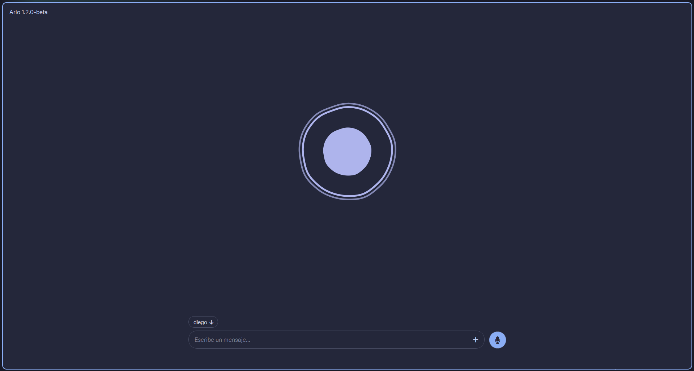

# ARLO
Adaptive Reasoning Local Operator is a local desktop assistant that uses 
Ollama to run tools and automate tasks on Windows. It requires Windows, 
PowerShell, Python 3.12, Git. The `arlo.ps1` launcher starts the 
application using the `.venv` virtual environment.
Configuration and user data are stored in `C:\Users\<username>\.arlo`. Refer to the source code and `config.json` to discover additional features and configuration options.

For an existing installation, you can start arlo directly by running `arlo.ps1`.

Arlo also has a desktop interface application (`scripts\arlo.bat`) which, if you 
ask me, works better for the public and for my own development.

Closing the desktop window keeps Arlo and its local services running in the
background. On desktops with a system tray, use the Arlo icon to reopen it or
quit it completely. On other desktops, launch Arlo again to restore the existing
instance instead of starting another one.

See more of its usage/application when you launch the script.
See the [specs here](docs/SPECS.md).

After updating, restart both the desktop app and its persistent TTS service so
they use the same interruption protocol. Offline regression checks can be run
with `.venv/Scripts/python.exe -m unittest discover -s test -v`.

Hands-free voice activation uses a wake phrase to start Arlo's normal voice
recording, including in corner mascot mode. See
[wake voice setup and configuration](docs/WAKE-VOICE.md). After updating, 
restart
the desktop and the `ARLO_WAKE` task. Wake regression checks:
`.venv/Scripts/python.exe -B -m unittest discover -s tests -v`.

With the desktop open, `reload`, `ref`, or `/reload` hot-reloads Arlo's loaded
source/tool modules and rebuilds the model tool registry for the following turn.
Live process infrastructure (Qt bridges, locks, timers, sessions, and memory) is
preserved so reloading does not require restarting the application.

For native voice input, tool execution, and action regression checks, see
[desktop action execution](docs/ACTION-EXECUTION.md).